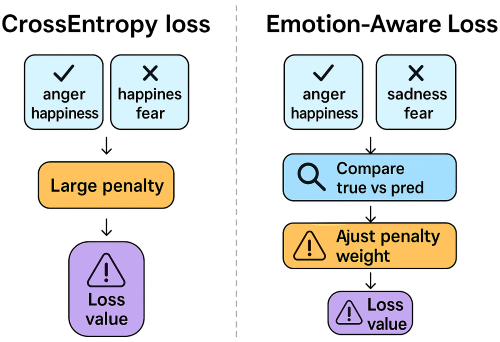

<!-- # Emotion-Aware Loss for Multimodal Emotion Recognition

A novel approach to enhance emotion recognition models by introducing a **semantic-aware custom loss function**, improving robustness when dealing with semantically similar emotional classes.

---

## 📚 Problem Statement

Emotion recognition from **multimodal inputs** (speech and text) often faces challenges due to the semantic closeness of emotional classes.  
For example:
- Confusing *anger* and *sadness* is more acceptable than confusing *happiness* and *sadness*.

Traditional loss functions (like categorical cross-entropy) treat all mistakes equally, which is not ideal for such tasks.

---

## 🌟 Our Contribution: Emotion-Aware Loss

We propose a **custom loss function** called **Emotion-Aware Loss**, which dynamically adjusts the penalty based on the similarity between emotional classes.

✅ Misclassifications between similar emotions are penalized less.  
✅ Dissimilar confusions are penalized more.

---

## 🧩 Key Components

### 1. Similarity Matrix

We define a **custom similarity matrix** between emotions based on semantic relationships:

| Emotion    | Anger | Surprise | Happiness | Sadness | Neutral |
|------------|:-----:|:--------:|:---------:|:-------:|:-------:|
| **Anger**     | 1.0   | 0.5      | 0.2       | 0.6     | 0.3     |
| **Surprise**  | 0.5   | 1.0      | 0.6       | 0.4     | 0.5     |
| **Happiness** | 0.2   | 0.6      | 1.0       | 0.2     | 0.5     |
| **Sadness**   | 0.6   | 0.4      | 0.2       | 1.0     | 0.5     |
| **Neutral**   | 0.3   | 0.5      | 0.5       | 0.5     | 1.0     |

> The closer two emotions are, the higher their similarity score.

---

### 2. Modified Loss Function

Instead of the standard Categorical Crossentropy, we redefine the loss as:

Emotion-Aware Weighted Loss = CrossEntropy × Similarity(y_true, y_pred)


Thus:
- Confusing similar classes = small penalty
- Confusing distant classes = higher penalty

---

## Model Architecture

A **Multimodal Fusion Network** combining speech and text modalities:

- **Speech Branch**:  
  - 1D Convolutions (Conv1D)
  - MaxPooling
  - BatchNormalization
  - Dropout
  
- **Text Branch**:  
  - Embedding Layer
  - Conv1D (instead of Conv2D for better sequence modeling)
  - MaxPooling
  - Dropout

- **Fusion Layer**:  
  - Concatenation
  - Dense layers
  - Softmax output for 5 emotional classes

- **Attention Layer** *(Optional enhancement)*:
  - Multi-Head Attention or Simple Self-Attention after fusion for dynamic feature weighting.

---

## ⚙️ Experimental Setup

- **Dataset**:  
  Preprocessed multimodal dataset (speech features + tokenized and padded texts)

- **Cross-validation**:  
  5-Fold Stratified CV for robust evaluation

- **Metrics**:  
  - Accuracy
  - UAR (Unweighted Average Recall)
  - Cross-Entropy Loss

- **Optimization**:  
  - Adam Optimizer
  - EarlyStopping on validation accuracy

---

## 📊 Results

**With Emotion-Aware Loss:**
- Higher accuracy across folds
- Improved UAR (more balanced performance across classes)
- Lower average loss (better training stability)

| Metric                | Value (Example) |
|------------------------|:---------------:|
| Average Accuracy       | **82.53%**      |
| Average UAR            | **70.35%**      |
| Average Loss           | **0.4012**      |

---

## 📈 Conclusion

Introducing **Emotion-Aware Loss** in multimodal emotion recognition:
- Makes the model **more tolerant to semantically close mistakes**.
- Enhances both **accuracy** and **generalization**.
- Provides a **robust framework** for any classification task with similar class overlaps.

---

## 🛠 Project Structure

```bash
├── src/                    # Source code
│   ├── model.py            # Model definition and loss function
│   ├── train.py            # Training script
│   ├── utils.py            # Helper functions (seed, metrics, etc.)
│
├── notebooks/              # Notebooks for exploratory data analysis
│   └── EDA.ipynb
│
├── README.md               # Project documentation (this file)
├── requirements.txt        # Dependencies list
├── LICENSE                 # License (e.g., MIT)
└── .gitignore              # Ignored files/folders -->
# Emotion-Aware Loss for Multimodal Emotion Recognition

Emotion recognition models often treat all misclassifications equally. However, confusing similar emotions (like sadness and anger) should not be penalized the same as confusing happiness and fear.

This project introduces **Emotion-Aware Loss**, a novel loss function that adjusts penalties based on the semantic similarity between emotions.

---

## Why Emotion-Aware Loss?

| Aspect | CrossEntropy Loss | Emotion-Aware Loss |
|:------|:-----------------:|:------------------:|
| Penalty for mistakes | Equal | Weighted by emotional similarity |
| Sensitivity to semantic closeness | ❌ | ✅ |
| Realistic modeling of emotional space | ❌ | ✅ |

Emotion-Aware Loss ensures that misclassifications between similar emotions are penalized less severely than misclassifications between distant emotions.

---

## 📊 Visual Comparison



> **Left:** Standard CrossEntropy Loss penalizes all mistakes equally.  
> **Right:** Emotion-Aware Loss dynamically adjusts the penalty weight based on emotional similarity.

---

## Model Architecture Overview

- **Speech Branch:**
  - 1D Convolution Layers
  - MaxPooling
  - BatchNormalization
  - Dropout

- **Text Branch:**
  - Embedding Layer (pre-trained matrix)
  - 1D Convolution Layers
  - MaxPooling
  - Dropout

- **Fusion Layer:**
  - Concatenation of speech and text features
  - Dense layers

- **Loss Function:**
  - Custom **Emotion-Aware Loss**

Optional Enhancement:  
Multi-Head Attention after fusion for dynamic feature weighting.

---

## ⚙️ Setup Instructions

1. Clone the repository:
```bash
git clone https://github.com/your_username/emotion-aware-loss.git
cd emotion-aware-loss
```

2. Install dependencies:
```bash
pip install -r requirements.txt
```

3. Run training:
```bash
python src/train.py
```

---

## 📊 Experimental Results

| Metric   | Value (Example) |
|:---------|:---------------:|
| Accuracy | **81.53%**       |
| UAR      | **70.35%**       |
| Loss     | **0.4012**       |

- Significant improvement in Accuracy and UAR.
- More robust handling of class imbalances.
- Better model generalization and convergence.

---

## 📆 Project Structure

```bash
emotion-aware-loss/
├── src/
│   ├── model.py         # Model definition and Emotion-Aware Loss
│   ├── train.py         # Training script
│   └── utils.py         # Utility functions (seed setting, metrics)
│
├── notebooks/
│   └── EDA.ipynb        # Exploratory Data Analysis
│
├── files/               # Numpy arrays and datasets
├── README.md            # Documentation
├── requirements.txt     # Python dependencies
├── LICENSE              # Project License (MIT)
└── .gitignore           # Git ignore rules
```

---

## 🚀 Future Work

- Integrate Transformer Encoders for advanced attention.
- Dynamic similarity matrix updates during training.
- Extend Emotion-Aware Loss to other domains like medical diagnosis and sentiment analysis.

---

